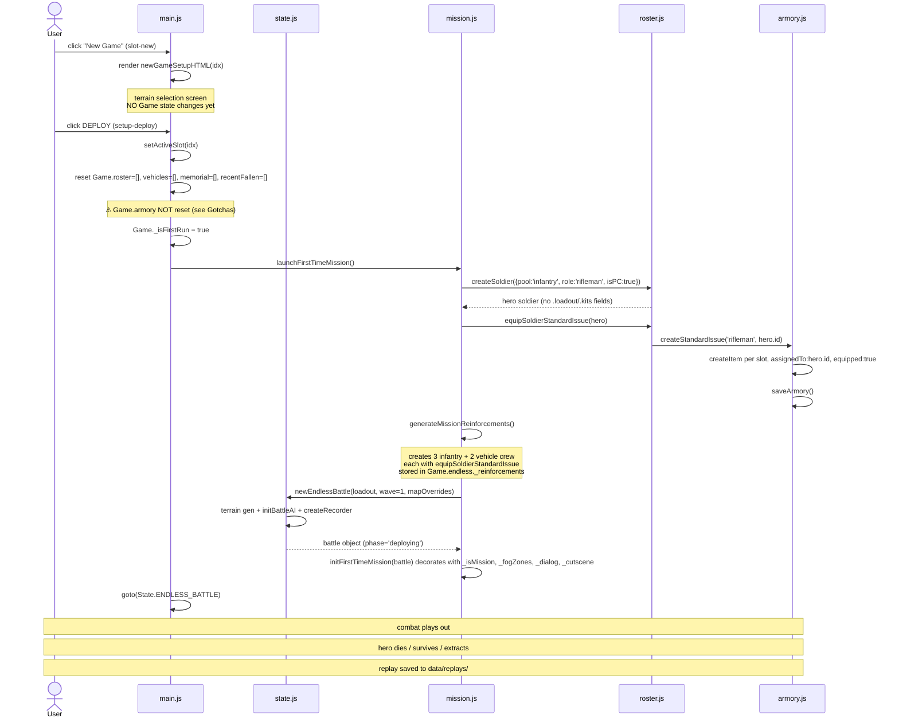

# Flow: Intro mission (first-time experience)

## Trigger

User clicks **"New Game"** on an empty save slot from the title screen.

- DOM event: `data-action="slot-new"` + `data-slot=<idx>` → `main.js:607` slot-new handler

## Sequence



## Walkthrough

1. **slot-new click** → `main.js:607`. Renders `newGameSetupHTML(idx)` (terrain selection). **No state changes** — slot isn't activated yet.

2. **setup-deploy click** → `main.js:615-647`. Reads seed selection, activates the slot, and inline-resets most of Game state:
   ```js
   setActiveSlot(idx);
   Game.roster = []; Game.vehicles = []; Game.memorial = []; Game.recentFallen = [];
   Game.resources = { scrap: 0, parts: 0 };
   Game.stats = { highestWave: 0, battles: 0, kills: 0 };
   Game._isFirstRun = true;
   Game._introSeed = seed;
   launchFirstTimeMission();
   goto(State.ENDLESS_BATTLE);
   ```
   **`storage.load()` is NEVER called here.** Armory cleanup happens inside `launchMission` (see step 3); since roster is `[]` here, the prune effectively wipes the armory.

3. **`launchFirstTimeMission()`** (`mission.js`) drives the rest:
   - **Prune orphan items** (`e30f8c2`) — any `armory.items[i]` whose `assignedTo` isn't in current roster is removed. Catches reinforcement gear from prior failed attempts. Canonical cleanup gateway for ALL mission launches (slot-new + in-mission retry).
   - `createSoldier` for the hero (`pool: 'infantry'`, `role: 'rifleman'`, `isPlayerCharacter: true`)
   - `equipSoldierStandardIssue(hero)` → creates 5 items in armory (M4A1, M9, iron_sights, light_vest, frag_grenade), all `assignedTo: hero.id, equipped: true`
   - `generateMissionReinforcements()` creates 5 entities — 3 infantry rifleman reinforcements + 2 vehicles. Each soldier gets its own `equipSoldierStandardIssue` call. Reinforcements live in `Game.endless._reinforcements` (separate from `Game.roster`)
   - `newEndlessBattle(loadout, 1, mapOverrides)` (`state.js:1571`) constructs the `Battle` object with terrain, hero placed at spawn, AI pipeline initialized
   - `initFirstTimeMission(battle)` decorates battle with `_isMission: true`, `_fogZones`, `_dialog`, `_cutscene`, `_mission`, `_fadeOverlay`, `_allowedEnemyTypes` (restricts enemy types for first mission)

4. **`goto(State.ENDLESS_BATTLE)`** transitions UI. Battle starts in `phase: 'deploying'` but the first-time mission usually fast-forwards through deploy because the mission script auto-positions units.

5. **Combat plays out** via the standard battle loop (`game.js`). The recorder captures frames at 10fps to `battle._recorder`. On mission end, replay is POSTed to `/api/replays` → saved to `data/replays/<timestamp>-<seed>.json`.

6. **Mission complete** → user clicks **"medevac-continue"** → `extractFromRun()` (`game.js:405`). First-time mission is designed so **nobody dies** — worst case is wounded. Hero + 3 infantry reinforcements transfer to `Game.roster` carrying their wounded/ready status. The 2 reinforcement vehicles are **removed** from `Game.vehicles` (since `33fc203` — they were transient; the `_isReinforcement: true` flag is the marker). No vehicle-crew soldier records exist to clean up — they were only synthesized at deploy-time as unit-level state, not persistent soldiers. Player returns to HQ for the first time.

## Non-obvious facts

- **`load()` is bypassed entirely.** The setup-deploy handler manually resets Game state inline rather than going through the normal load flow. As a result:
  - `seedStarterRoster()` does NOT run on first mission (it's only called from `storage.load()`)
  - `_migrateRoster()` does NOT run on first mission
  - `_migrateToArmorySOT()` does NOT run on first mission (and `armory._sotMigratedV1` flag stays `null` for slots that only ever did first-mission)
  - All starter content (roster, armory items) comes from `launchMission` and `generateMissionReinforcements` directly
- **First-mission roster size is 1 + 3 = 4 soldiers** in `Game.roster` (hero + 3 infantry reinforcements). The 2 vehicles count separately in `Game.vehicles`. Total of "5 units + hero" the player sees on the field is hero + 3 infantry + 2 vehicles
- **Reinforcements aren't in `Game.roster`** until they join post-mission (or possibly mid-mission — verify per mission script). They live in `Game.endless._reinforcements` during the mission
- **`Game.armory.items` is NOT reset on setup-deploy.** Only `roster/vehicles/memorial/recentFallen/resources/stats` get cleared. Dead soldiers from prior attempts leave orphan items behind (gear with `assignedTo` pointing at IDs no longer in roster). See [Bug Task #130](../../../) — this matters once wave-end loot (#105) is wired
- **`Game._isFirstRun` and `Game._introSeed`** are flags set by setup-deploy, not by mission.js. They drive the first-mission cinematic path
- **The intro mission uses `_allowedEnemyTypes`** to restrict enemies to swarmer/grunt (mission.js:155). Tougher types appear in later endless mode
- **By design, nobody dies in the intro mission** — worst outcome is `status: 'wounded'` (with `hpPercent ≈ 0.05` and a `woundedBattlesLeft` countdown). No KIA path is exercised. `destroyGear` is NOT called in this flow
- **There's a separate retry-on-death path at `game.js:2802`** (`b._isMission`) that bypasses `setup-deploy` and calls `launchFirstTimeMission()` directly. Since `e30f8c2`, this still gets the orphan-item cleanup because the prune lives inside `launchMission` — both code paths converge there
- **Since `fd2ce61`, the hero unit carries gear-derived combat stats** (`_gearAccuracy`, `_gearCritChance`, `_gearPenetration`, etc.). These are injected in the opsConfig hero-soldier patch block at `state.js:~1780` via `getEffectiveCombatStats(heroSoldier)`. Pre-fix, the hero unit had only the era-template base damage/range/fireRate, with all derived stats defaulting to 0 or null — the hero specifically was missed when `f84482e` wired gear-derived combat stats for soldier-pool units
- **There are no vehicle-crew soldier records.** `generateMissionReinforcements` creates only infantry reinforcements (3 rifleman soldiers). `createVehicle` creates pure vehicle structs (id/unitId/hp/condition/status), no crew soldiers. Vehicle crew are synthesized at deploy-time as unit-level state and have no `armory.items` of their own. There is no vehicle-crew-orphan issue
- **Vehicles do NOT persist post-mission** (since `33fc203`). `extractFromRun` filters out `_isReinforcement: true` vehicles from `Game.vehicles` before saving. The reinforcement Shermans served as in-mission entities only

## What this flow *doesn't* do

- **Call `storage.load()`** — bypassed entirely. Skips the entire load-time migration chain
- **Trigger `_migrateToArmorySOT`** — that runs from `load()`. First-mission soldiers don't need it (they're created clean by `createSoldier`)
- **Seed starter roster (45 starters)** — `seedStarterRoster()` lives behind `load()`. Real first-mission content comes from `launchMission` + `generateMissionReinforcements`
- **Initialize Game.armory** — relies on `_ensureArmory()` lazy-init from the first `createItem` call. `armory.kits = {}` set by the same lazy-init path
- **Update `Game.stats.battles` / `Game.stats.kills`** — mission complete returns to HQ but doesn't bump these counters (verify if this is a bug — possibly only updates per endless-mode wave-complete, not first-mission complete)
- **Kill the player** — intro mission has no KIA path; wounded is the worst outcome by design
- **Persist mission vehicles to motor pool** — `extractFromRun` filters out `_isReinforcement: true` vehicles since `33fc203`. They exist in `Game.vehicles` only during the mission
- **Create vehicle-crew soldier records** — no such records exist. Crew are unit-level synthesized state, not persistent soldiers

## Cross-references

- [Soldier Lifecycle](../systems/soldier-lifecycle.md) — `createSoldier`, `equipSoldierStandardIssue`, reinforcement generation
- [Armory](../systems/armory.md) — item ownership semantics, `armory.kits[soldier.id]`
- [Battle Phases](../systems/battle-phases.md) — what happens once `goto(State.ENDLESS_BATTLE)` fires
- [Deploy Panel](../systems/deploy-panel.md) — UI during `phase: 'deploying'`
- Object shapes touched: [Soldier](../references/soldier.md), [Item](../references/item.md), [Battle](../references/battle.md)
- [ADR-0004](../decisions/ADR-0004-armory-single-source-of-truth.md) — equipment ownership model

---

*Update by running `/update-flow intro-mission` after touching `js/main.js` slot handlers, `js/mission.js`, or `js/state.js newEndlessBattle`. Always refresh `verified` + `verified_hash`.*
