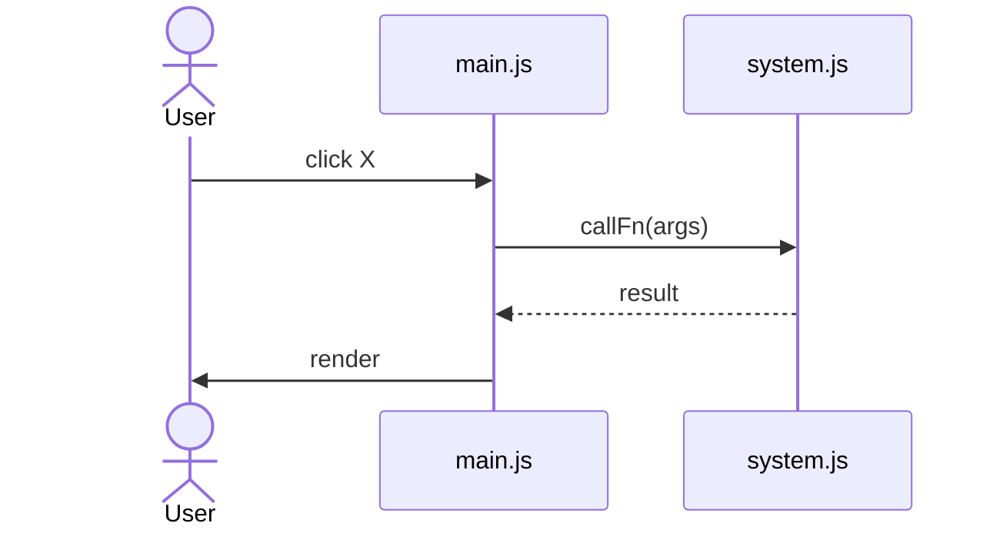

# Flow: <user-facing journey name>

## Trigger

What the user does to enter this flow (button click, key press, etc.) and the entry-handler that fires.

- User clicks **X** → `file.js:N handlerName`

## Sequence

## Walkthrough

Step-by-step prose pairing each box of the diagram with the actual code path + file:line refs. Lean on system docs for *system-internal* detail; this flow only describes the **cross-system orchestration**.

1. **User clicks X** → `file.js:N`. Reads selected slot, validates Y.
2. **callFn(args)** → `system.js:M`. See [system-a](../systems/system-a.md#section) for what this does internally.
3. ...

## Non-obvious facts

What's surprising or easy to miss about this flow. Include things that confused us before.

- Does NOT call `load()` — fresh state initialized inline (and that's intentional because Z).
- `seedStarterRoster()` is skipped; soldiers come from `launchMission` + `generateMissionReinforcements` instead.
- Field `foo` is mutated mid-flow; downstream readers need to handle the transient value.

## What this flow *doesn't* do

Things readers might assume happen here but actually don't.

- Save to localStorage (saved on a different event)
- Apply XYZ migration (only runs on slot-select path)

## Cross-references

- [System A](../systems/system-a.md), [System B](../systems/system-b.md)
- [ADR-NNNN](../decisions/ADR-NNNN-slug.md)
- Object shapes touched: [Soldier](../references/soldier.md), [Battle](../references/battle.md)

---

*Update by running `/update-flow <name>` after touching the listed files. Always refresh `verified` and `verified_hash`.*
